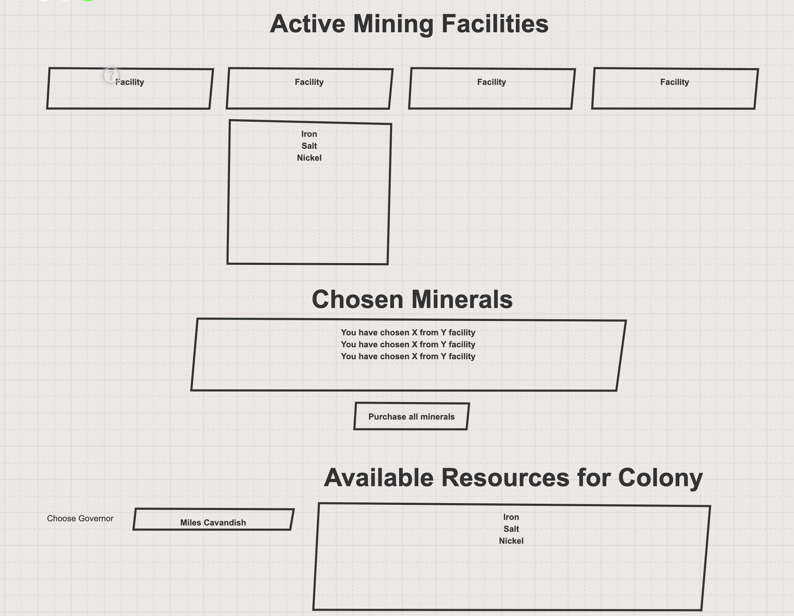

# Will You Be Mine

This project has you building an application that lets governors of different colonies in our Solar System purchase minerals from various mining facilities that human have established.

Below you can ready some basic information about the properties and relationships of the data you need for this application. There are several issue tickets created that tell you how the project should function. This project has been extensively planned by your project owner, and so you must build it to those specifications. Do not deviate from the definition of the features in the issue tickets.

If you need clarification about the functionality, please contact your product owner. You do not have the authority to change the intended functionality defined in the tickets.

## Governors

Each human habitation colony in the Solar System _(Earth, Mars, Europa, etc...)_ has a governor. To keep each colony running efficiently, the governor has to purchase essential minerals from lightly staffed mining facilities that have been established on asteroids, moons, and rocky planets.

From time to time, governors take leaves of absence, so their status can change from active to inactive. Only active governors should be displayed in the UI.

## Colonies

Each colony can have one, or more, active governor depending on the size of the colony. For example, Earth could support up to five governors that are responsible for different regions of the planet.

## Mining Facilities

Each mining facility can be active or inactive depending on the changes of staffing from the various companies that operate the facilities. Each object representation should record the name of the facility and its active status.

If a mining facility is inactive, then the button in the UI should never be enabled, even after a governor is chosen.

## Minerals

Each mining facility can produce several kinds of minerals. Each mineral type can be produced at several mining facilities.

## Wireframe

This is the general layout provided by your product owner. Please follow this guideline for your project's layout.

